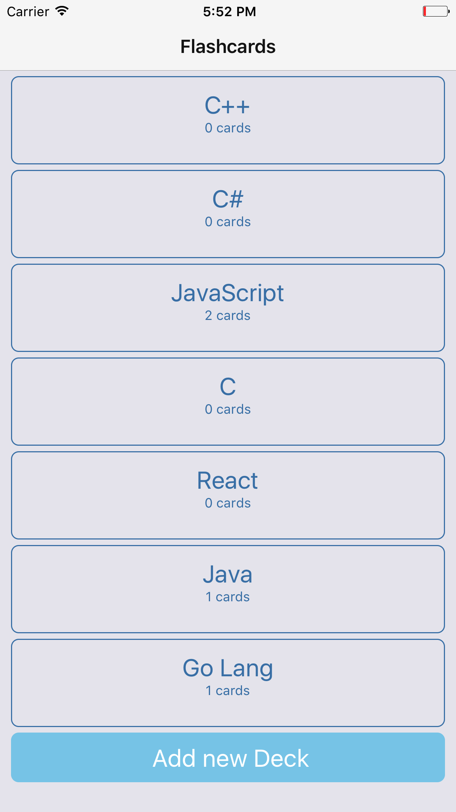
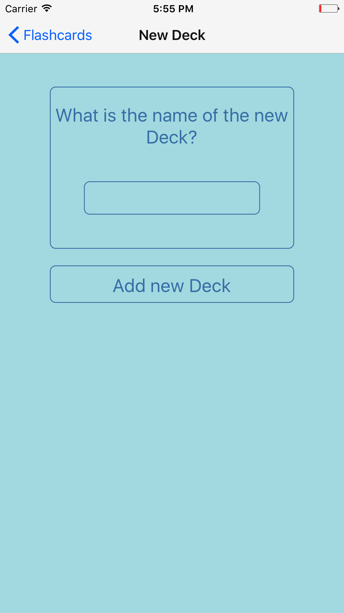
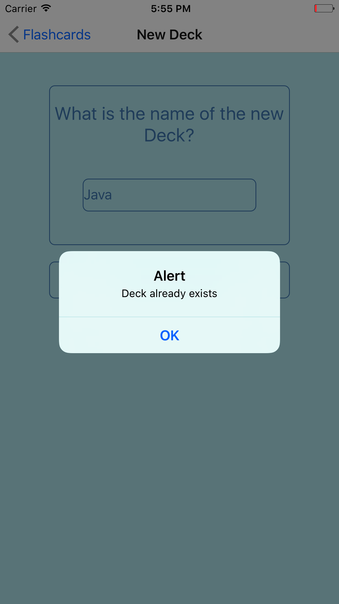
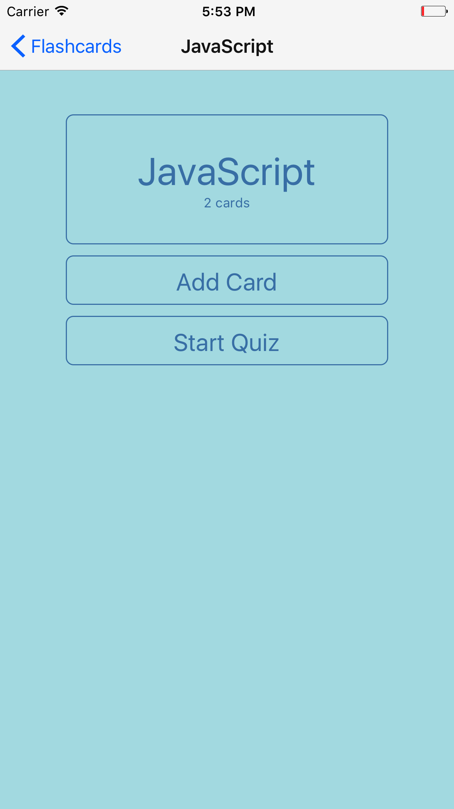
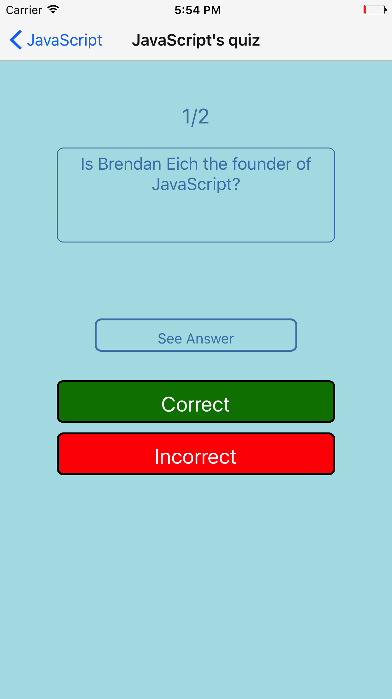
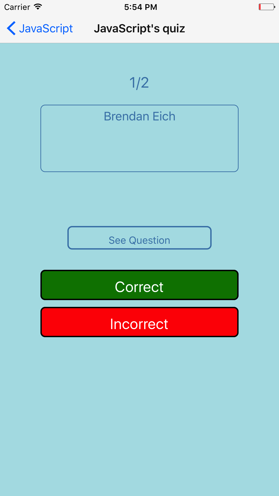

This project was bootstrapped with [Create React Native App](https://github.com/react-community/create-react-native-app).

# Flashcards

## How to run the project

`git clone https://github.com/adityamehra/flash-cards.git`

`cd flash-cards`

`yarn install`

`yarn start`

__Note__: You can install [expo](https://expo.io/) on your iPhone and run the app by scanning the QR code from the expo app __OR__ use the iPhone simulator.

## Project Overview

Flashcards allow users to study collections of flashcards. The app allow users to create different categories of flashcards called "decks", add flashcards to those decks, then take quizzes on those decks.

## Views of the app

### 1. Deck List View

### 2. New Card View 

### 3. New Deck View

### 4. Single Card View

### 5. Quiz View

## Contributions 

Feel free to fork/download the repo and use the project.

## Licencse

MIT license

