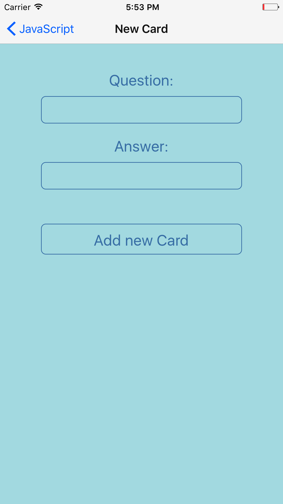

This project was bootstrapped with [Create React Native App](https://github.com/react-community/create-react-native-app).

# Flashcards

## Project Overvie

Flashcards allow users to study collections of flashcards. The app allow users to create different categories of flashcards called "decks", add flashcards to those decks, then take quizzes on those decks.

## Views of the app

### 1. Deck List View

### 2. New Card View 

### 3. New Deck View

### 4. Single Card View

### 5. Quiz View

